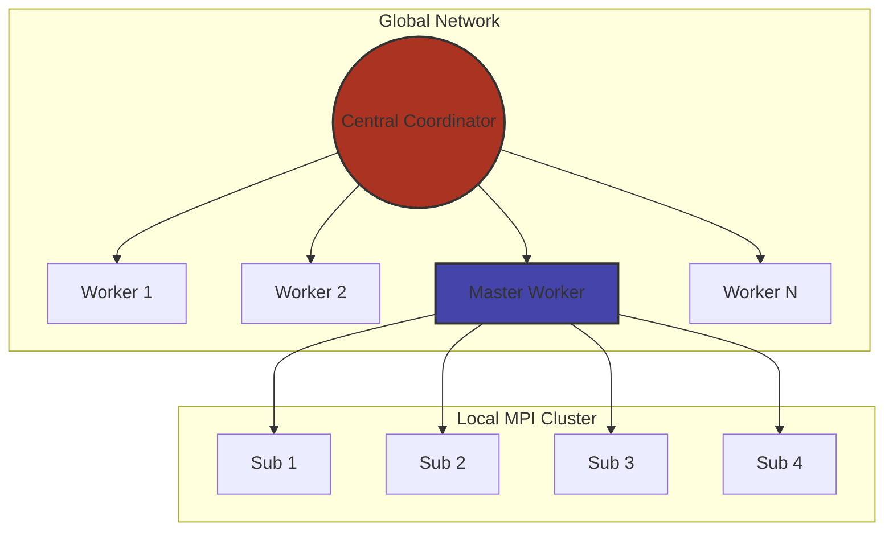

# 🛰️ Distributed Computing Project

A high-performance platform for **amateur and independent research**. We combine the numerical rigor of Fortran with the systems orchestration of C to enable large-scale scientific experiments on diverse hardware.

---

## 🏗️ System Architecture

The project utilizes a tiered distribution model. A central **Coordinator** manages a heterogeneous pool of workers, some of which may act as **Master Workers** for local high-performance clusters (MPI).



### 🧬 Layer Responsibilities

| Role | Responsibility | Language |
| --- | --- | --- |
| **Coordinator** | Task scheduling, worker health monitoring, data aggregation. | C |
| **Worker** | Standard compute node processing individual work units. | C / Fortran |
| **Master Worker** | Acts as a gateway for local clusters; translates global tasks to MPI. | C |
| **Sub-Worker** | Executes high-speed numerical kernels within a local cluster. | Fortran |

---

## 🎯 Project Core Pillars

> [!IMPORTANT]
> This is a **science-first** platform. Every design choice prioritizes bit-for-bit reproducibility over architectural convenience.

* **Numerical Correctness:** Minimal side effects in kernels to ensure identical results across different architectures.
* **Hybrid Scaling:** Efficiently utilizes everything from a single laptop to a multi-node MPI cluster.
* **Clear Boundaries:** A strict C ABI separates the "Systems C" from the "Numerical Fortran."

---

## 📂 Repository Structure

<details>
<summary><b>▶ Click to expand directory details</b></summary>

| Directory | Content |
| --- | --- |
| `src/` | C runtime, scheduler, and networking logic. |
| `fortran/` | Numerical kernels and scientific models. |
| `include/` | Public C headers and the stable ABI definitions. |
| `tests/` | Comprehensive unit and integration test suites. |
| `examples/` | Reference experiments (e.g., N-Body, Fluid Dynamics). |
| `tools/` | CLI utilities for monitoring worker clusters. |

</details>

---

## 🛠️ Building & Requirements

The project uses **CMake** and requires a dual-compiler environment.

### Prerequisites

* **C Compiler:** GCC (C11) or Clang
* **Fortran Compiler:** GFortran (2008+)
* **Math Libs:** BLAS and LAPACK
* **Optional:** OpenMPI / MPICH (required for Master/Sub-worker clusters)

### Quick Start

```bash
mkdir build && cd build
cmake .. -DENABLE_MPI=ON
make -j$(nproc)

```

> [!TIP]
> If you are running on a standalone machine, you can disable MPI during the CMake step to simplify dependencies: `cmake .. -DENABLE_MPI=OFF`.

---

## 🤝 Contributing

We welcome contributions that expand the scientific reach of this platform.

### Current Priorities:

* [ ] Optimization of the C ABI for low-latency task handoff.
* [ ] New Fortran kernels for Monte Carlo simulations.
* [ ] Improved telemetry in the `Coordinator` dashboard.

> [!NOTE]
> Please review `docs/fortran_guidelines.md` before writing kernels. We enforce **Fixed-Point** or **Deterministic Floating Point** strategies to maintain reproducibility.

---

## ⚖️ Licence

Distributed under the **Apache V2 License**. See `LICENSE` for details.