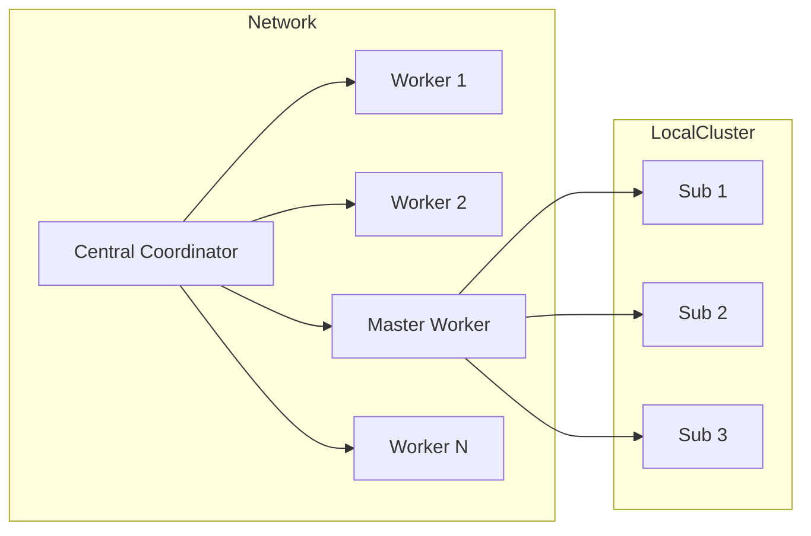

# 🛰️ Distributed Computing Project

[](./LICENSE)
[](#)

> **Science-first distributed compute platform**: Fortran for numerical kernels, C for runtime and orchestration. Designed for reproducible, long-lived scientific computation on heterogeneous hardware.

---

## Table of contents

1. [Quick start](#quick-start)
2. [What this project is](#what-this-project-is)
3. [Features](#features)
4. [Architecture at a glance](#architecture-at-a-glance)
5. [Build and run](#build-and-run)
6. [Testing and CI](#testing-and-ci)
7. [Contributing](#contributing)
8. [Roadmap & TODOs](#roadmap--todos)
9. [Licence](#licence)

---

## Quick start

Clone, build, run the minimal example.

```bash
git clone https://github.com/your-org/your-repo.git
cd your-repo
mkdir build && cd build
cmake .. -DENABLE_MPI=OFF
cmake --build . -- -j$(nproc)
# run the coordinator locally (example)
./bin/coordinator --config ../examples/minimal_cluster/config.yaml
```

See the `examples/` directory for runnable reference setups.

---

## What this project is

A hybrid C and Fortran platform that separates numeric work from system-level code. Fortran implements deterministic numerical kernels and models. C implements scheduler, transport, runtime and system APIs.

This README was updated to reflect the full design and API contracts. For formal interface and design guidance see `DESIGN.md` (core architecture, ABI contracts and directory layout).

---

## Features

* Explicit C / Fortran boundary with stable ABI
* Deterministic numerical kernels and seeded RNGs
* Multiple transport backends (MPI, ZeroMQ, etc)
* Checkpointing and reproducible test harnesses
* Unit and integration tests for both languages

<details>
<summary><b>Why Fortran + C?</b></summary>

* Fortran for numerical reliability and long-term stability.
* C for portable system code, scheduling and networking.

</details>

---

## Architecture at a glance



For a full breakdown of directories, ABI and function contracts consult `DESIGN.md`.

---

## Build and run

### Prerequisites

* C compiler: GCC or Clang (C11 or newer)
* Fortran compiler: GFortran (Fortran 2008 or newer)
* CMake
* BLAS / LAPACK
* Optional: OpenMPI or MPICH when using the MPI backend

### Recommended local build

```bash
mkdir -p build && cd build
cmake .. -DENABLE_MPI=OFF -DCMAKE_BUILD_TYPE=Release
cmake --build . -- -j4
```

### Running examples

See `examples/minimal_cluster/` for a minimal single-machine setup. The coordinator executable accepts `--config` pointing to YAML described in `examples/`.

---

## Testing and CI

* Unit tests exist under `tests/` for both C and Fortran.
* Integration tests cover mixed-language execution paths.

Suggested CI steps (GitHub Actions):

* matrix build for compilers (GCC/Clang, GFortran)
* run `cmake --build` and `ctest`
* optional `docker` image build for reproducible test runs

---

## Contributing

Please read `CONTRIBUTING.md` and `docs/fortran_guidelines.md` before submitting patches.

* Use the stable C ABI in `include/fortran_api.h` when adding Fortran entry points
* Keep Fortran pure: no networking, no process control
* Keep C minimal: no numerical kernels in C

If you add a public ABI change, provide a new symbol rather than changing an existing symbol. Backwards compatibility is a first-class goal.

---

## Roadmap & TODOs

* [ ] Improve coordinator telemetry and dashboard
* [ ] Add more Monte Carlo kernels in Fortran
* [ ] Provide a GitHub Actions CI workflow and binary release pipeline

---

## Licence

This project is licensed under the Apache License 2.0. See `LICENSE`.

---

## Where to read next

* `docs/` — coding guidelines and numerical reproducibility notes.
