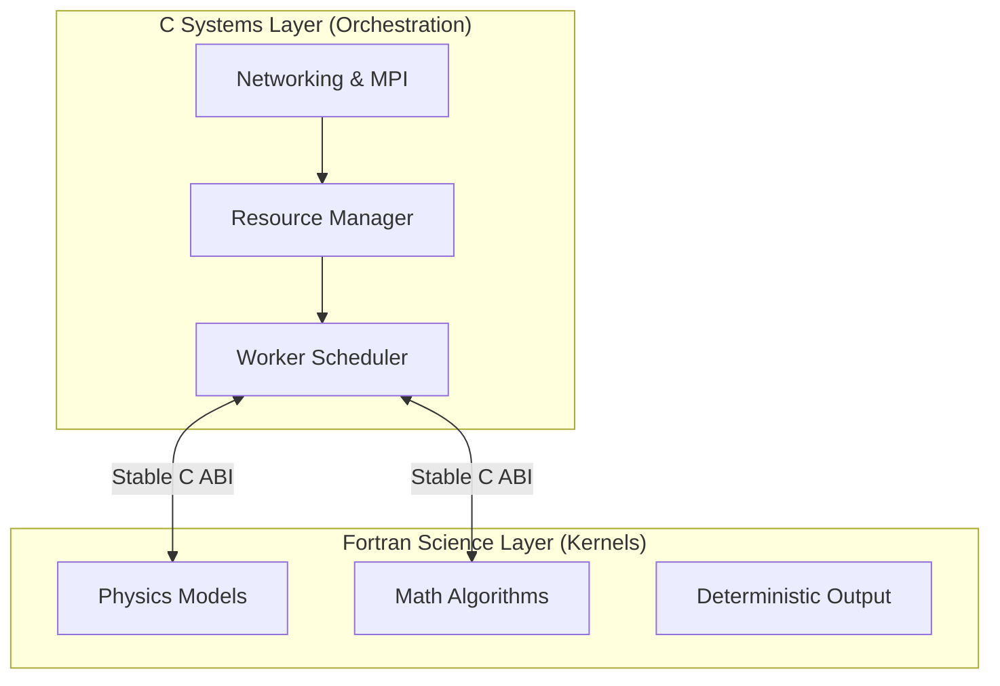

# 🛰️ Distributed Computing Project

A high-performance distributed platform tailored for **amateur and independent research** in physics and mathematics. We bridge the gap between high-level scientific modeling and low-level systems engineering.

---

## 🎯 Project Core Pillars

> [!IMPORTANT]
> This is **not** a general-purpose cloud framework. It is an **explicitly science-first** platform where numerical integrity outweighs architectural abstraction.

| Feature | Description |
| --- | --- |
| **Numerical Correctness** | Bit-for-bit reproducibility across different runs. |
| **Commodity Hardware** | Optimized for consumer-grade CPUs and local clusters. |
| **Separation of Concerns** | Strict boundary between science logic and systems logic. |
| **Inspectability** | Code is written to be read and verified by researchers, not just machines. |

---

## 🏗️ Architecture & Language Split

We utilize a "Dual-Engine" approach, leveraging the specific strengths of Fortran and C through a stable C ABI.



### 🧬 Responsibilities

* **Fortran (The "Brain"):** Numerical kernels, math algorithms, and physics models. Minimal side effects.
* **C (The "Body"):** Networking, messaging (MPI), worker orchestration, and metadata handling.

---

## 📂 Repository Structure

<details>
<summary><b>▶ Click to expand directory details</b></summary>

| Directory | Content |
| --- | --- |
| `src/` | C runtime, scheduler, and networking logic. |
| `fortran/` | Numerical kernels and scientific models. |
| `include/` | Public C headers and the stable ABI definitions. |
| `tests/` | Comprehensive unit and integration test suites. |
| `examples/` | Reference experiments and sample configurations. |
| `tools/` | CLI utilities for diagnostics and monitoring. |

</details>

---

## 🛠️ Building the Project

### Prerequisites

* **Compilers:** GCC (C11) & GFortran (2008+)
* **Libraries:** BLAS, LAPACK
* **Optional:** MPI for multi-node distribution

### Quick Start

```bash
# Clone and enter the directory
git clone https://github.com/user/project-name.git && cd project-name

# Standard build workflow
mkdir build && cd build
cmake .. -DCMAKE_BUILD_TYPE=Release
make -j$(nproc)

```

> [!TIP]
> For performance-critical research, ensure you link against an optimized BLAS implementation like OpenBLAS or Intel MKL.

---

## 🤝 Contributing

We welcome contributions from researchers and engineers alike.

### Current Priorities:

* [ ] Implementation of Runge-Kutta 4th Order kernels.
* [ ] Improved documentation for the C-Fortran interface.
* [ ] Validation cases for fluid dynamics models.

> [!NOTE]
> Please review the `docs/fortran_guidelines.md` and `docs/c_guidelines.md` before submitting a Pull Request.

---

## ⚖️ Licence

Distributed under the **Apache V2 Licence**. See `LICENSE` for more information.
